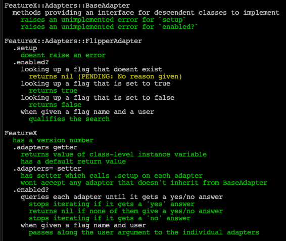

# FeatureX

The goal here is to replace all our feature flag calls with one to this
gem's.

That will let us migrate the flags from one provider to another more easily

# Todos

Add more adapters - ENV, Mixpanel, Yaml file, etc.

## Development

The tests are a good reflection of the current development state.

Simply run them with `rspec` after bundle installing.



## Installation

Add this line to your application's Gemfile:

```ruby
gem 'feature_x'
```

And then execute:

    $ bundle

Or install it yourself as:

    $ gem install feature_x

## Usage

Currently the only available adapter is Flipper.

Will update this document when more are added.

To set it up, put this in an initializer file:

```ruby
FeatureX.adapters = [FeatureX::Adapters::FlipperAdapter]
```

This `adapters=` will internally call the `.setup` method on the FlipperAdapter, which performs the Flipper initialization.

Then call `FeatureX.enabled?("flag name")`

It will iterate through the adapters until one of them returns true/false.